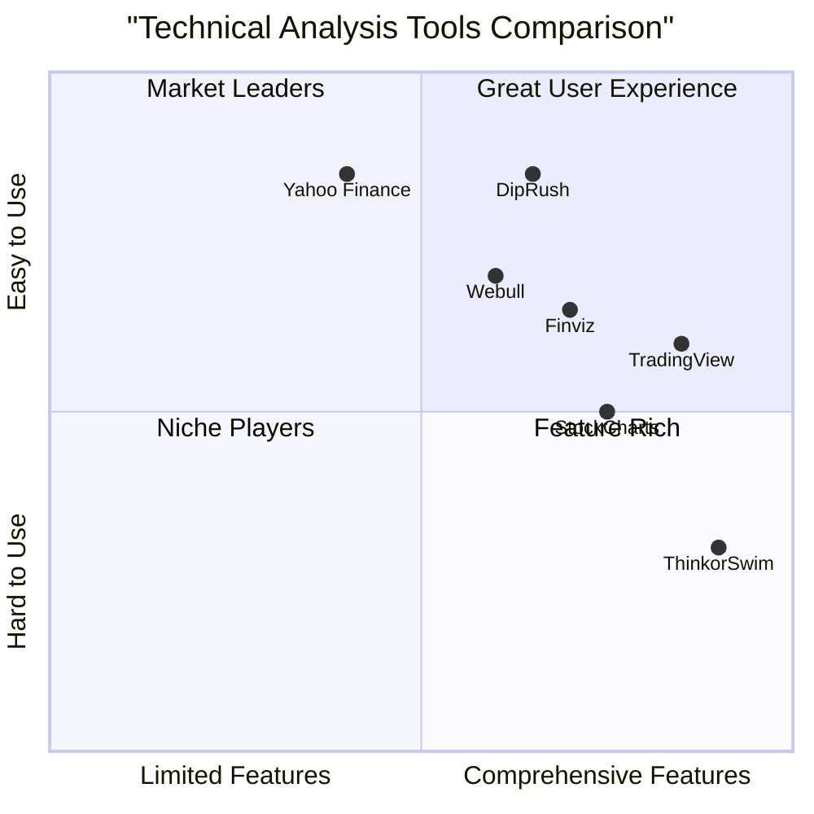

# DipRush: Financial App for Market Dip Detection

## Project Information

**Project Name:** diprush
**Project Version:** 1.0.0
**Programming Language:** TypeScript
**Frontend Framework:** React with Next.js
**Styling Framework:** TailwindCSS
**Deployment Platform:** Cloudflare Pages

## Original Requirements

Create a modern "DipRush" financial app for catching market dips with these specifications:

- TypeScript-only frontend (no backend)
- React with Next.js
- TailwindCSS for styling
- Cloudflare Pages deployment ready
- Clean architecture with directory structure:
  - /components (reusable UI)
  - /hooks (custom hooks)
  - /services (API clients)
  - /utils (helper functions)
  - /types (TypeScript interfaces)
  - /context (global state)

Features:
1. Finnhub API Integration
   - User API key input with local storage
   - Error handling for API limits/failures
   - Loading states for data fetching
   - US market stock data visualization with charts (use recharts or Chart.js)
   
2. Technical Analysis Tool
   - Identify stocks where:
     * RSI < 30
     * MACD shows bullish reversal
     * Price crosses below lower Bollinger Band
     * 50-day MA crosses above 200-day MA (Golden Cross)
   - Display results in sortable table
   - Show "The greatest wisdom lies in patience" when no matches

UI Requirements:
- Responsive design (mobile, tablet, desktop)
- i18n support (English/Chinese toggle)
- Dark/light mode toggle with system preference detection
- Clean, modern interface with intuitive navigation
- Accessible components (ARIA, keyboard navigation)

Security: Store API keys securely in browser, clear instructions for users.

## 1. Product Definition

### 1.1 Product Goals

1. **User Empowerment**: Provide retail investors with professional-grade technical analysis tools to identify potential market dips and buying opportunities
2. **Accessibility**: Make complex financial data visualization and technical indicators accessible to both novice and experienced traders through an intuitive interface
3. **Efficiency**: Streamline the stock screening process by automating the detection of specific technical patterns that indicate potential market dips

### 1.2 User Stories

1. As a retail investor, I want to quickly identify stocks that meet specific technical criteria indicating a potential dip, so that I can make informed buying decisions without manually screening hundreds of stocks.
2. As a technical trader, I want to visualize stock data with key technical indicators overlaid on price charts, so that I can perform deeper analysis on potential opportunities.
3. As a mobile user, I want to access the dip detection tool on my smartphone or tablet with the same functionality as the desktop version, so that I can monitor market opportunities while away from my computer.
4. As a Chinese-speaking user, I want to toggle the interface language to Chinese, so that I can better understand the technical analysis terms and navigation elements.
5. As a privacy-conscious user, I want to securely store my API key locally without sharing it with any third party, so that I can maintain control over my data access credentials.

### 1.3 Competitive Analysis

#### TradingView
- **Pros**: Comprehensive charting tools, extensive technical indicators, strong community features
- **Cons**: Complex interface for beginners, many advanced features require paid subscription, not focused specifically on dip detection

#### Stock Screener by Finviz
- **Pros**: Powerful filtering capabilities, multiple technical and fundamental criteria, clean data presentation
- **Cons**: Limited charting capabilities in free version, no specific dip detection focus, desktop-optimized interface

#### ThinkorSwim by TD Ameritrade
- **Pros**: Professional-grade technical analysis, customizable scans, integrated trading platform
- **Cons**: Steep learning curve, requires account registration, resource-intensive desktop application

#### Yahoo Finance
- **Pros**: Free access to market data, basic technical charts, widely accessible
- **Cons**: Limited technical screening capabilities, ad-supported interface, basic technical indicators

#### StockCharts
- **Pros**: High-quality technical charts, good technical indicator library, educational content
- **Cons**: Best features behind paywall, not optimized for mobile, no specific dip detection algorithm

#### Webull
- **Pros**: Free technical analysis tools, mobile-first design, user-friendly interface
- **Cons**: Limited customization for technical scans, focused on their own trading platform, some data limitations

#### DipRush (Our Target Product)
- **Pros**: Focused specifically on dip detection, clean modern interface, fully responsive, no account required, open API integration
- **Cons**: No integrated trading capabilities, requires user's API key, limited to technical (not fundamental) analysis

### 1.4 Competitive Quadrant Chart



## 2. Technical Specifications

### 2.1 Requirements Analysis

DipRush is a single-page application (SPA) that will be built using modern web technologies focused on the frontend only. The application will leverage the AKTools API to fetch financial data and perform technical analysis on that data directly in the browser. The core technical requirements include:

1. **Frontend Architecture**: Pure TypeScript implementation using React and Next.js framework ensuring type safety and component reusability.

2. **API Integration**: Seamless connection to AKTools financial API, with appropriate error handling and loading states.

3. **Technical Indicators**: Implementation of multiple technical indicators (RSI, MACD, Bollinger Bands, Moving Averages) either through AKTools's API or through client-side calculation libraries.

4. **Data Visualization**: Responsive and interactive charts for stock price and technical indicator visualization using either recharts or Chart.js.

5. **User Experience**: Multilingual support, theme customization, responsive design across all device sizes, and accessibility compliance.

6. **Local Storage**: Secure storage of user preferences in the browser's local storage with appropriate security measures.

7. **Deployment**: Configuration for seamless deployment to Cloudflare Pages with appropriate build settings for Next.js applications.

### 2.2 Requirements Pool

#### P0 (Must Have)

1. Application must fetch and display stock data from AKTools API with appropriate error handling
2. Application must implement technical analysis screening to detect stocks meeting all specified criteria:
   - RSI below 30
   - MACD showing bullish reversal
   - Price crossing below lower Bollinger Band
   - 50-day MA crossing above 200-day MA (Golden Cross)
3. Results must be displayed in a sortable table format
4. Application must show a message "The greatest wisdom lies in patience" when no stocks match the criteria
5. UI must be responsive, adapting to mobile, tablet, and desktop viewports
6. Application must support both English and Chinese language toggle
7. Application must implement dark/light mode toggle with system preference detection

#### P1 (Should Have)

1. Application should provide interactive price charts with technical indicators overlay for selected stocks
2. Application should implement loading states for API requests with visual indicators
3. Application should provide clear error messages for API limits or failures
4. Application should allow users to customize technical indicator parameters (e.g., RSI period, Bollinger Band standard deviations)
5. Application should provide a dashboard view summarizing market conditions and dip opportunities
6. Application should include accessible components with ARIA support and keyboard navigation
7. Application should implement efficient caching strategies to minimize redundant API calls

#### P2 (Nice to Have)

1. Application may allow users to save favorite stocks or create watchlists
2. Application may provide historical alerts to track past dip detections and their outcomes
3. Application may implement push notifications for new dip detections when supported by browser
4. Application may provide educational tooltips explaining technical indicators and dip strategies
5. Application may support additional technical indicators beyond the core requirements
6. Application may allow custom screening criteria configuration
7. Application may implement data export functionality for detected dips

### 2.3 UI Design Draft

#### 2.3.1 Main Layout

The application will follow a clean, modern interface with a layout that includes:

- **Header**: Logo, language toggle (EN/CN), theme toggle (light/dark)
- **Dashboard**: Summary of market conditions and dip detection metrics
- **Screening Results**: Sortable table of stocks meeting dip criteria
- **Chart View**: Interactive chart for detailed analysis of selected stocks
- **Footer**: Attribution, version information, and helpful links

#### 2.3.2 Key Screen Flows

1. **First-time User Flow**:
   - Welcome screen explaining the application
   - API key setup guide with security information
   - Dashboard introduction with tutorial tooltips

2. **Regular User Flow**:
   - View updated dip detection results
   - Sort and filter results based on various metrics
   - Select individual stocks for detailed chart analysis
   - Adjust technical indicator parameters if needed

3. **Mobile User Flow**:
   - Collapsed menu for navigation
   - Tabs for switching between dashboard and detailed views
   - Optimized touch interactions for chart manipulation
   - Simplified table view with essential information

#### 2.3.3 Component Hierarchy

```
- App
  |- Header
     |- Logo
     |- LanguageToggle
     |- ThemeToggle
  |- ApiKeyManager
  |- Dashboard
     |- MarketSummary
     |- ScreeningCriteriaDisplay
  |- DipDetectionResults
     |- ResultsTable
        |- TableHeader
        |- TableRows
        |- EmptyStateMessage
     |- Pagination
  |- StockDetailView
     |- PriceChart
        |- ChartControls
        |- TechnicalOverlays
     |- IndicatorDetails
  |- Footer
```

### 2.4 Open Questions

1. **API Rate Limiting**: How should the application handle AKTools API rate limiting beyond basic error messages? Should we implement a queuing system for requests or provide estimated wait times?

2. **Data Freshness**: How frequently should the application refresh data, and should users have control over the refresh rate considering API call limitations?

3. **Market Coverage**: Should the application focus exclusively on US markets as specified, or should we design with the possibility of expanding to other markets in the future?

4. **Stock Universe**: How should we determine which stocks to screen? Should we use a predefined list, popular indices, or allow users to specify their universe?

5. **Technical Indicator Calculation**: Should we rely on AKTools's API for technical indicator calculations or implement our own client-side calculations for more flexibility?

6. **Offline Capabilities**: Should we implement any offline capabilities, such as caching previous results or allowing offline viewing of already loaded data?

7. **User Preferences**: Beyond theme and language, what additional user preferences should be stored locally for a personalized experience?

8. **Performance Optimization**: What strategies should be employed to ensure the application remains responsive when processing large datasets or rendering complex charts?

## 3. Implementation Guidelines

### 3.1 Project Structure

Follow the specified clean architecture with this directory structure:

```
/
├── components/          # Reusable UI components
│   ├── layout/         # Layout components (Header, Footer, etc.)
│   ├── charts/         # Chart components
│   ├── tables/         # Table components
│   ├── forms/          # Form components
│   └── ui/             # Basic UI components (buttons, inputs, etc.)
├── hooks/              # Custom React hooks
│   ├── useApi.ts       # API interaction hooks
│   ├── useTechnicalAnalysis.ts # Technical analysis hooks
│   └── useLocalStorage.ts # Local storage management hooks
├── services/           # API clients and services
│   ├── aktools/        # AKTools API client
│   └── analyticService.ts # Technical analysis service
├── utils/              # Helper functions
│   ├── formatters.ts   # Data formatting utilities
│   ├── indicators.ts   # Technical indicator calculations
│   └── validators.ts   # Validation utilities
├── types/              # TypeScript interfaces and types
│   ├── api.ts          # API response types
│   ├── indicators.ts   # Technical indicator types
│   └── ui.ts           # UI component prop types
├── context/            # React context for global state
│   ├── ApiKeyContext.tsx # API key management context
│   ├── ThemeContext.tsx # Theme management context
│   └── LanguageContext.tsx # Language management context
├── pages/              # Next.js pages
├── public/             # Public assets
│   ├── locales/        # Internationalization files
│   └── images/         # Images and icons
└── styles/             # Global styles and Tailwind configuration
```

### 3.2 Technical Stack Details

- **Framework**: Next.js with React 18+
- **Language**: TypeScript 4.9+
- **Styling**: TailwindCSS 3.0+
- **Charts**: Recharts or Chart.js (final decision to be made during development)
- **State Management**: React Context API
- **Internationalization**: next-i18next
- **API Client**: Axios or SWR for data fetching
- **Testing**: Jest and React Testing Library
- **Deployment**: Cloudflare Pages

### 3.3 Development Workflow

1. **Environment Setup**:
   - Initialize Next.js project with TypeScript
   - Configure TailwindCSS
   - Set up directory structure
   - Configure i18n

2. **Core Features Implementation**:
   - API key management and storage
   - AKTools API integration
   - Technical indicator implementation
   - Screening logic

3. **UI Implementation**:
   - Responsive layouts
   - Chart components
   - Results table
   - Theme system

4. **Testing**:
   - Unit tests for utilities and hooks
   - Component tests
   - Integration tests

5. **Optimization**:
   - Performance auditing
   - Bundle size optimization
   - Accessibility audit

6. **Deployment**:
   - Cloudflare Pages configuration
   - CI/CD setup

## 4. Success Metrics

### 4.1 Technical Metrics

1. **Performance**:
   - First Contentful Paint under 1.5 seconds
   - Time to Interactive under 3 seconds
   - Score of 90+ on Google Lighthouse performance audit

2. **Code Quality**:
   - 90%+ TypeScript code coverage
   - No TypeScript any types
   - All ESLint rules passing

3. **Accessibility**:
   - WCAG 2.1 AA compliance
   - 100% keyboard navigable
   - Screen reader compatible

### 4.2 User Experience Metrics

1. **Usability**:
   - Successfully set up API key in under 2 minutes
   - Access screening results in under 3 clicks
   - Switch between themes and languages in 1 click

2. **Accuracy**:
   - Technical indicators correctly identifying market conditions
   - No false positives in dip detection

3. **Responsiveness**:
   - Fully functional across all target device sizes
   - No broken layouts or unusable features on mobile devices

## 5. Future Considerations

1. **Feature Expansion**:
   - Additional technical indicators and screening criteria
   - Fundamental data integration
   - Custom alert configurations

2. **Integration Possibilities**:
   - Multiple data provider options beyond AKTools
   - Portfolio tracking capabilities
   - Social sharing of detected opportunities

3. **Monetization Potential**:
   - Premium features for advanced screening criteria
   - API key provision for users without AKTools access
   - White-label solutions for financial advisors

## 6. Appendix

### 6.1 Technical Indicators Reference

#### Relative Strength Index (RSI)
A momentum oscillator that measures the speed and change of price movements on a scale from 0 to 100. Values below 30 generally indicate oversold conditions (potential dip buying opportunity).

#### Moving Average Convergence Divergence (MACD)
A trend-following momentum indicator showing the relationship between two moving averages of a security's price. A bullish reversal occurs when the MACD line crosses above the signal line while both are below zero.

#### Bollinger Bands
Consist of a middle band (usually a simple moving average) and two outer bands that are standard deviations away from the middle band. When price crosses below the lower band, it may indicate an oversold condition (potential dip).

#### Moving Averages (50-day and 200-day)
The Golden Cross occurs when a shorter-term moving average (50-day) crosses above a longer-term moving average (200-day), potentially indicating a bullish long-term trend despite short-term dips.

### 6.2 AKTools API Reference

Key endpoints that will be used:

- Stock Daily Data: `/api/public/stock_zh_a_daily`
- Historical Data: `/api/public/stock_zh_a_hist`
- Company Information: `/api/public/company_profile`

Rate limits and API requirements will be handled according to AKTools's API documentation with a limit of 50 requests per second.

### 6.3 Glossary

- **Technical Analysis**: The study of past market data to forecast price trends
- **Market Dip**: A short-term decrease in market price that may represent a buying opportunity
- **RSI**: Relative Strength Index, a momentum oscillator
- **MACD**: Moving Average Convergence Divergence, a trend-following momentum indicator
- **Bollinger Bands**: A technical analysis tool defined by price and volatility
- **Golden Cross**: When a short-term moving average crosses above a long-term moving average
