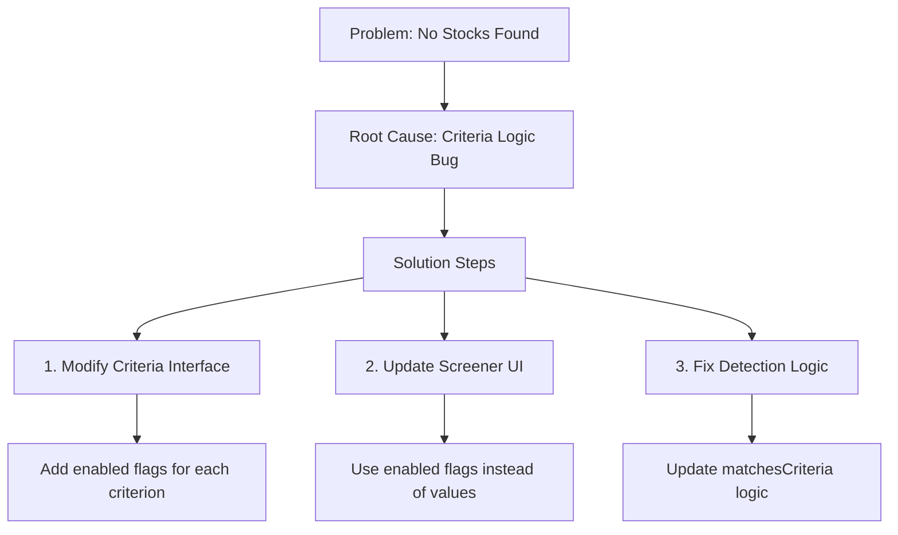

# Decision Log

## 2025-03-05: Fix Screener Criteria Logic

### Context
The Screener functionality is not finding any matching stocks despite data being fetched correctly from AKTools. Upon investigation, the issue stems from incorrect interpretation of screening criteria flags in the detectDips method.

### Problem
The current criteria logic incorrectly uses numeric/boolean values as enablement flags:
```typescript
result.matchesCriteria =
  (criteria.rsiThreshold ? result.rsiBelowThreshold : true) &&
  (criteria.macdSignalCrossover ? result.macdBullishCross : true) &&
  (criteria.bollingerBandTouch ? result.belowLowerBollingerBand : true) &&
  (criteria.goldenCross ? result.goldenCross : true);
```

This causes:
- RSI threshold (being a number) is always truthy unless 0
- Boolean flags are used both for enablement and criteria values

### Decision
Modify the screening criteria architecture to clearly separate enablement flags from criteria values:

1. Update ScreeningCriteria interface:
```typescript
interface ScreeningCriteria {
  rsiEnabled: boolean;
  rsiThreshold: number;
  macdSignalCrossoverEnabled: boolean;
  bollingerBandTouchEnabled: boolean;
  goldenCrossEnabled: boolean;
}
```

2. Update detection logic:
```typescript
result.matchesCriteria =
  (!criteria.rsiEnabled || result.rsiBelowThreshold) &&
  (!criteria.macdSignalCrossoverEnabled || result.macdBullishCross) &&
  (!criteria.bollingerBandTouchEnabled || result.belowLowerBollingerBand) &&
  (!criteria.goldenCrossEnabled || result.goldenCross);
```

3. Update UI components to handle enabled states separately from values.

### Consequences
- Clearer separation between criteria enablement and values
- More intuitive user experience in the UI
- Reduced likelihood of logical errors in criteria evaluation
- Proper filtering of stocks based on user-selected criteria

### Implementation Plan


## 2025-03-05: Remove API Key Requirement

### Context
Initially, the application required users to provide an API key for accessing financial data. This requirement has been removed as the application no longer requires external API authentication.

### Decision
1. Remove API Key Management functionality
2. Update documentation to reflect this architectural change
3. Simplify user onboarding process

### Consequences
- Improved user experience with no API key setup required
- Simplified application architecture
- Reduced security concerns related to API key management
- Updated documentation to maintain accuracy

### Implementation
- Removed API Key Management section from WIKI.md
- Renumbered functional modules to maintain documentation consistency
- Updated documentation to reflect current application requirements

## 2025-03-05: Update Documentation - Remove Finnhub API References

### Context
As part of the migration from Finnhub to AKTools, the WIKI.md documentation still contained outdated references to the Finnhub API integration that needed to be removed to maintain accuracy.

### Decision
1. Update project documentation to remove all Finnhub API references
2. Update Backend Services section to reflect AKTools integration
3. Maintain consistency with current system architecture

### Consequences
- Documentation accurately reflects current system architecture
- Reduces potential confusion for new developers
- Maintains alignment with recent API key removal decision
- Better represents the simplified integration with AKTools

### Implementation
- Updated Project Summary section to reference AKTools instead of Finnhub
- Updated Backend Services section in Technology Stack
- Maintained all technical analysis and feature descriptions
- Ensured consistency with recent architectural changes

## 2025-03-06: Change Default Theme to Light ✅

### Context
Previously, the application's default theme was set to 'system', using the user's system preference. This update ensures new users consistently start with the light theme.

### Decision
1. Updated default theme from 'system' to 'light' in ThemeContext.tsx
2. Maintained all theme functionality (users can still select dark or system theme)
3. Modified only the default for new users without preferences

### Technical Implementation
Updated the useLocalStorage hook initialization in ThemeContext.tsx:
```typescript
// Changed from
const [theme, setThemeValue] = useLocalStorage<Theme>(
  'diprush-theme',
  'system'
);

// To
const [theme, setThemeValue] = useLocalStorage<Theme>(
  'diprush-theme',
  'light'
);
```

### Consequences
- New users now always get the light theme by default
- Existing users retain their chosen theme preferences
- Enhanced consistency in user experience for new users
- Potential reduction in eye strain for users in bright environments
